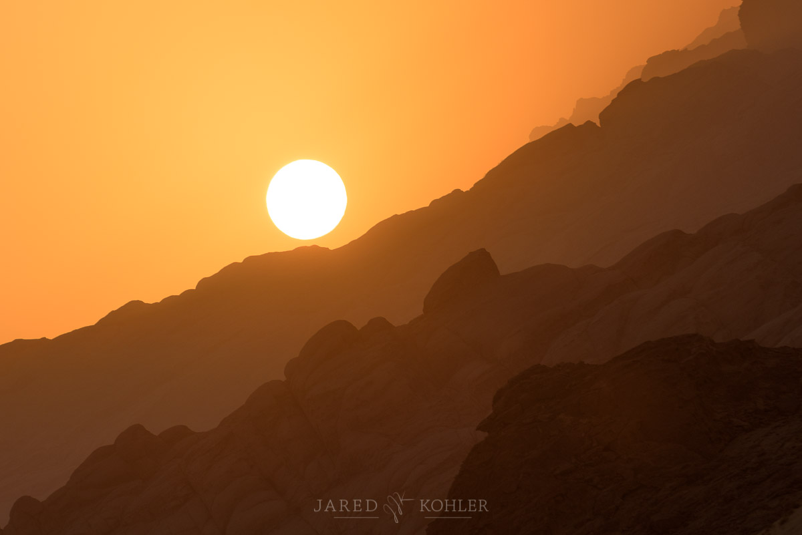

# Portfolio
Jared's GIS Project Portfolio

# About Me
I've ***loved*** maps since I was little. My grandfather knew my obsession and whenever he saw a free travel map offered he would write on my behalf and have the maps sent to me in the mail. I would treasure each map as it arrived and ultimately created a file box to store and organize all of my maps for enjoyment and future viewing. So, you could say I've like maps for a long time...

While studying my undergrad I every wall of my bedroom was covered in NatGeo and antique world maps and I paid my way through both film school and an International Relations degree by doing GIS work for oil industry clients, using *GeoGrafix* and *Petra* mapping softwares.

I currently work at the CREATELab on CMU campus, mostly with their EarthTime GIS project. In the course of my work there I often go back and forth between *QGIS*, *ArcGIS*, *Mapbox*, *GeoPandas*, *Google Earth*, and a handful of other mapping related tools. A bad day working with maps is better than a good day doing many other things.

# What I Hope to Learn

Although I have worked with maps for many years, I'm really excited to dive deeper into more of the theory and consideration behind what makes one map compelling and another merely average or even ineffective. *ArcGIS Pro* is not the sharpest tool in my box. Due to the fact that I usually am in a workflow that does not use ESRI tools, I still have gaps in my command of ArcGIS and hope to gain some new competencies in more advanced tools.

I also hope to gain more insight about how to effectively managed GIS projects that necessarily involve numerous people and data sources. Best practices for how to manage this often chaotic process would be much valued.

# Portfolio

